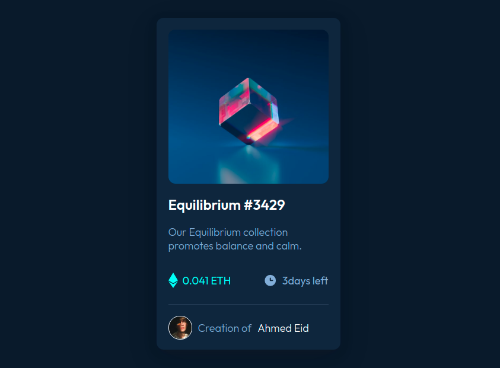

# Frontend Mentor - NFT preview card component solution

This is a solution to the [NFT preview card component challenge on Frontend Mentor](https://www.frontendmentor.io/challenges/nft-preview-card-component-SbdUL_w0U). Frontend Mentor challenges help you improve your coding skills by building realistic projects. 

## Table of contents

- [Overview](#overview)
  - [The challenge](#the-challenge)
  - [Screenshot](#screenshot)
  - [Links](#links)
- [My process](#my-process)
  - [Built with](#built-with)
  - [What I learned](#what-i-learned)
  - [Useful resources](#useful-resources)
- [Author](#author)


## Overview

### The challenge

Users should be able to:

- View the optimal layout depending on their device's screen size
- See hover states for interactive elements

### Screenshot

#### Design

#### Solution (HTML & CSS)



### Links

- Solution URL: [https://github.com/ahmedmohamedeid98/nft-preview-card-component.git](https://github.com/ahmedmohamedeid98/nft-preview-card-component.git)
- Live Site URL: [https://ahmedmohamedeid98.github.io/nft-card-component/](https://ahmedmohamedeid98.github.io/nft-card-component/)

## My process

### Built with

- Semantic HTML5 markup
- CSS custom properties
- Flexbox
- Mobile-first workflow
- Font Family: [Outfit](https://fonts.google.com/specimen/Outfit)
- Weights: 300, 400, 600

### What I learned

### overlaying one layer on another

```css
.containr {
  position: relative;
}
.original-layer {
  display: block;
  width: 100%;
}

.overlay-layer {
  position: absolute;
  top: 0;
  left: 0;
  width: 100%;
  height: 100%;
  opacity: 0; /* hide this layer */
  translation: opacity 0.25s; /*animate opacity*/
}

.overlay-layer:hover {
  opacity: 1;
}

```


### Useful resources

- [css scan](https://getcssscan.com/css-box-shadow-examples) - here you will find a lot of css shadow example.


## Author

- Github - [Ahmed Eid](https://github.com/ahmedmohamedeid98/)
- Frontend Mentor - [@ahmed eid](https://www.frontendmentor.io/profile/ahmedmohamedeid98)
- Linkedin - [@ahmed eid](https://www.linkedin.com/in/ahmedmohamedeid/)
